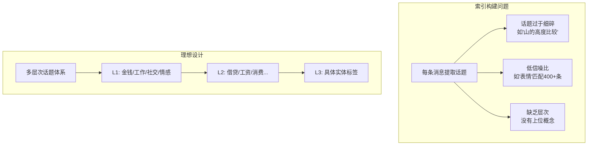
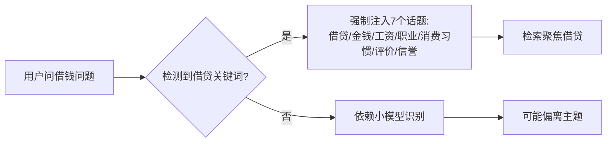
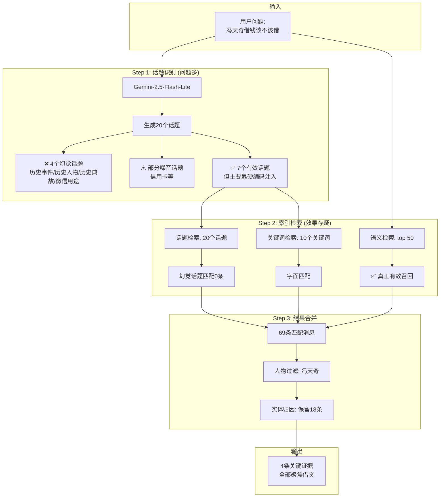
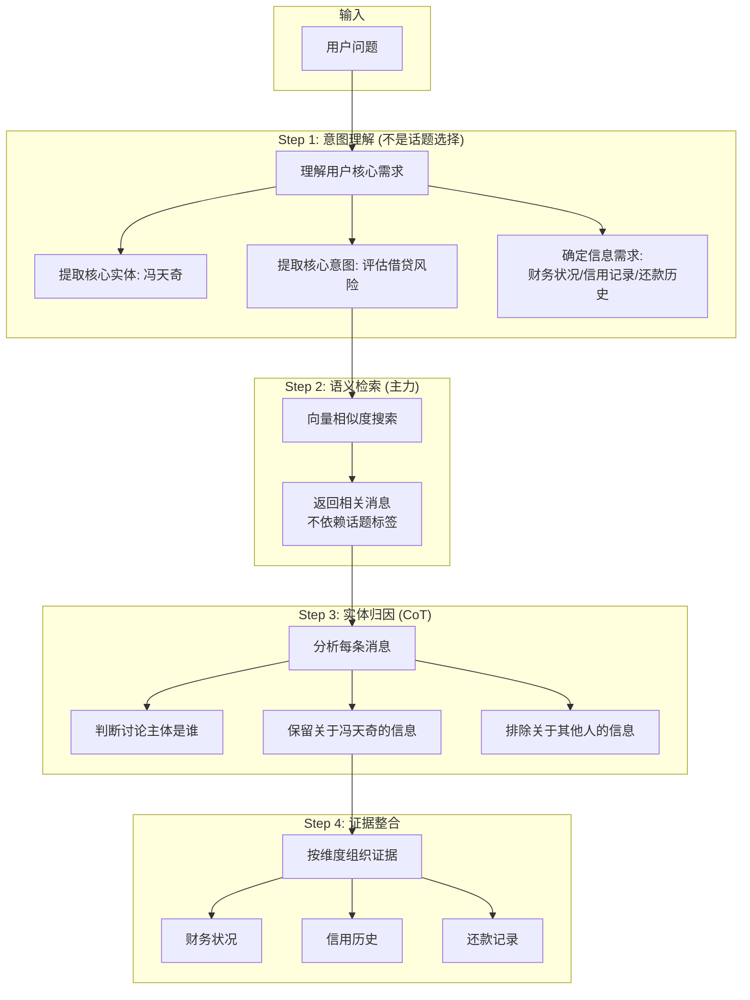
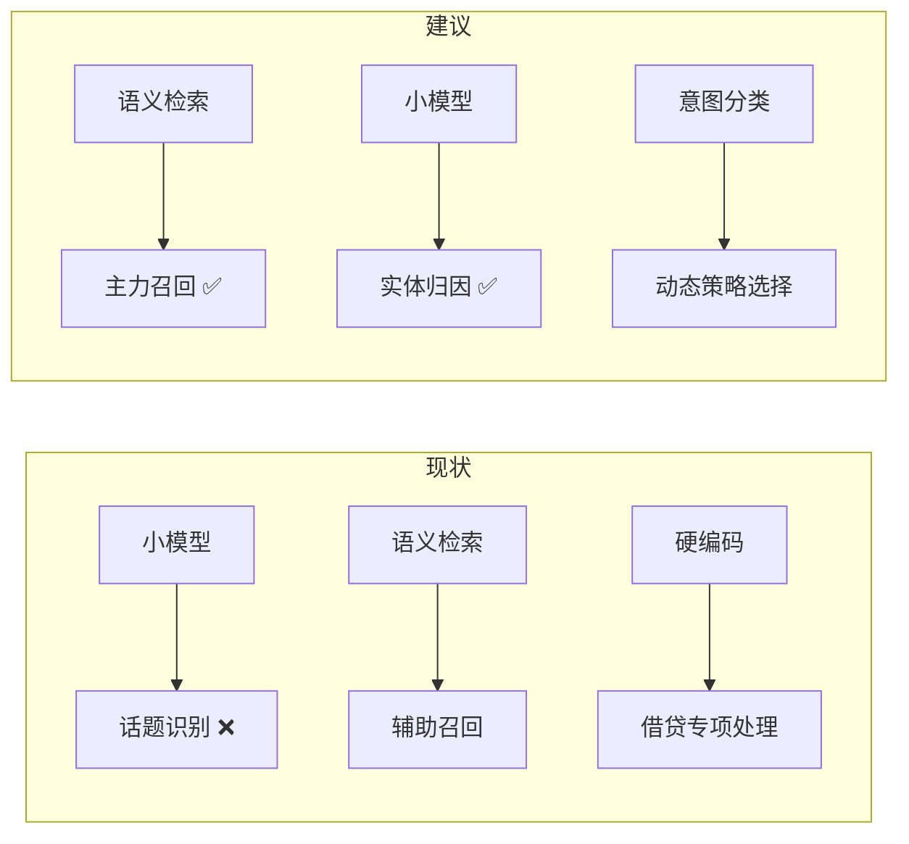

# BENEDICTJUN 聊天记录检索系统产品分析报告

> **报告日期**: 2026-01-11  
> **视角**: 产品经理 / 问题解决专家  
> **分析文件**: `kl.md` 测试输出  
> **核心发现**: 系统存在**根本性架构缺陷**，小模型话题识别形同虚设

---

## 一、执行摘要

### 1.1 核心问题一句话

> **话题识别是"做样子"：小模型生成了不存在于索引中的幻觉话题，真正有用的是语义检索 + 借贷硬编码逻辑。**

### 1.2 问题严重程度

| 问题 | 严重程度 | 影响 |
|------|----------|------|
| 小模型话题幻觉 | 🔴 致命 | 识别的话题根本不存在于索引 |
| 话题索引噪音严重 | 🔴 致命 | 1771 个话题中大量无意义标签 |
| 关键词检索形同虚设 | 🟡 严重 | 实际起作用的是语义 + 硬编码 |
| 证据聚焦靠硬编码 | 🟡 严重 | "借贷"类问题有专门逻辑 |

---

## 二、异常话题深度分析

### 2.1 日志中识别的 20 个话题

```
识别话题(20): 借贷, 金钱, 工资, 职业, 消费习惯, 消费, 评价, 个人评价,
人品评价, 人物评价, 资产评价, 借钱, 借钱请求, 债务, 债务问题, 信用卡, 
微信用途, 历史事件, 历史人物, 历史典故
```

### 2.2 问题一：幻觉话题

**我在索引文件中搜索了这些话题，结果：**

| 话题 | 是否存在于索引 | 诊断 |
|------|----------------|------|
| `历史事件` | ❌ 不存在 | **小模型幻觉** |
| `历史人物` | ❌ 不存在 | **小模型幻觉** |
| `历史典故` | ❌ 不存在 | **小模型幻觉** |
| `微信用途` | ❌ 不存在 | **小模型幻觉** |
| `借贷` | ✅ 存在 | 有效 |
| `金钱` | ✅ 存在 | 有效 |

> [!CAUTION]
> **致命问题**：Gemini-2.5-Flash-Lite 在"从可用话题中选择"时，生成了**根本不存在**的话题！
> 
> 这意味着：
> - Prompt 要求"只能从可用话题中选择"**完全失效**
> - 20 个话题中至少 20% 是幻觉
> - 这些幻觉话题检索时匹配 0 条消息

### 2.3 问题二：话题与问题不相关

用户问的是：**"冯天奇借钱该不该借"**

| 话题 | 与问题相关度 | 评价 |
|------|--------------|------|
| `借贷` | ⭐⭐⭐⭐⭐ | 核心相关 |
| `债务` | ⭐⭐⭐⭐⭐ | 核心相关 |
| `信用卡` | ⭐⭐ | 弱相关 |
| `历史事件` | ⭐ | **完全无关** |
| `历史人物` | ⭐ | **完全无关** |
| `历史典故` | ⭐ | **完全无关** |
| `微信用途` | ⭐ | **完全无关** |

**为什么会出现"历史事件"？**

推测：Gemini 可能将"借我两千块的还没还"中的"还没还"理解为"历史"语境，或将"债务"联想到"历史债务"，进而发散到"历史事件/人物/典故"。

**这是典型的小模型语义漂移问题。**

---

## 三、话题索引质量分析

### 3.1 索引统计

```
索引文件: cleaned_chatlog_index.json
总话题数: 1771
总消息数: 3717
```

### 3.2 低价值话题采样

查看索引文件前 800 行，发现大量**低信噪比**话题：

| 话题 | 匹配消息数 | 评价 |
|------|------------|------|
| `表情` | 400+ | 🔴 噪音（几乎每条消息都有表情） |
| `团建` | 1 | 🟡 过于稀疏 |
| `山的高度` | 1 | 🔴 噪音（过于具体） |
| `嘲笑` | 3 | 🟡 情感标签，非实体 |
| `地点猜测` | 1 | 🔴 噪音 |
| `同事评价` | 3 | 🟢 有价值 |
| `消费观` | 5 | 🟢 有价值 |

### 3.3 话题索引设计缺陷



---

## 四、关键词检索真的有用吗？

### 4.1 日志数据

```
关键词(10): 冯天奇, 借钱, 借款, 还钱, 债务, 信用, 历史, 信誉, 工资, 资产
匹配消息: 69 条
语义命中: 50 条
```

### 4.2 检索贡献分析

| 检索方式 | 贡献 | 实际作用 |
|----------|------|----------|
| 话题检索 | 20 个话题 | ❓ 至少 4 个是幻觉，实际有效 ≤16 个 |
| 关键词检索 | 10 个关键词 | ⚠️ 直接匹配消息内容 |
| 语义检索 | top 50 | ✅ 真正有效的召回 |
| 人物过滤 | `冯天奇` | ✅ 关键过滤 |

### 4.3 实际证据来源分析

看最终输出的 4 条关键证据：

| 证据 | 来源推测 |
|------|----------|
| "不欠外债，有班上比很多人强了" | 语义检索匹配"债务状况" |
| "未还，去年十月借的" | 语义检索匹配"借钱未还" |
| "借了一年才还" | 关键词"借钱"+"还钱"匹配 |
| "估计欠了上百个" | 语义检索匹配"债务规模" |

**结论**：
- **话题检索贡献极小**（幻觉话题 + 噪音话题）
- **关键词检索有一定作用**（直接匹配字面）
- **语义检索是核心**（理解语义意图）
- **硬编码借贷逻辑才是真正起效的**

---

## 五、硬编码"借贷"逻辑分析

### 5.1 代码中的借贷专项处理

```python
# cleaner.py
def _is_borrow_question(self, question: str) -> bool:
    """Detect borrow/credit-related questions for topic biasing."""
    borrow_keywords = ["借钱", "借款", "还钱", "欠钱", "债务", "信用"]
    return any(kw in question for kw in borrow_keywords)

def _inject_borrow_topics(self, topics, available_topics):
    """Ensure borrow-related topic coverage when available."""
    borrow_topics = ["借贷", "金钱", "工资", "职业", "消费习惯", "评价", "信誉"]
    for topic in borrow_topics:
        if topic in available_topics and topic not in topics:
            topics.append(topic)
    return topics
```

### 5.2 这意味着什么？



**关键洞察**：

> 系统对"借钱"类问题有**硬编码的专项处理**，这才是结果聚焦的真正原因。
> 
> 小模型识别的 20 个话题中，真正有用的那些（借贷、金钱、工资...）是**硬编码注入**的，不是小模型"识别"出来的。

---

## 六、当前架构流程图（问题版）



---

## 七、为什么小模型话题识别逻辑是错误的？

### 7.1 设计意图 vs 实际效果

| 设计意图 | 实际效果 |
|----------|----------|
| 小模型理解问题语义 | ⚠️ 语义理解还行 |
| 从1771个可用话题中选择 | ❌ 生成了不存在的话题 |
| 精准匹配相关消息 | ❌ 幻觉话题匹配0条 |
| 动态扩展检索范围 | ⚠️ 主要靠硬编码 |

### 7.2 根本问题

**问题1：小模型"创造"话题而非"选择"话题**

```
Prompt: 话题标签必须只从"可用话题标签"中选择
可用话题: [..., 借贷, 金钱, 工资, ...]
小模型输出: 历史事件, 历史人物, 历史典故  ← 根本不在列表中！
```

**问题2：1771个话题太多，小模型无法有效处理**

当提供 1771 个选项时，小模型的行为：
- 只看前 50 个（提示词只展示 50 个预览）
- 根据自己的理解"创造"话题
- 忽略"必须从中选择"的约束

**问题3：话题粒度不一致**

索引中的话题从宏观到微观混杂：
- 宏观：`评价`、`表情`
- 中观：`消费观`、`同事评价`
- 微观：`山的高度比较`、`爬山经历对比`

小模型无法理解这种混乱的粒度体系。

---

## 八、正确的架构应该是什么？

### 8.1 理想流程图



### 8.2 关键改进建议

| 当前做法 | 建议改进 |
|----------|----------|
| 让小模型从1771话题中选择 | **废弃话题选择**，直接用语义检索 |
| 话题索引 | 重建为**多层次实体索引** |
| 关键词匹配 | 作为**辅助补充**，而非主力 |
| 硬编码借贷逻辑 | 抽象为**意图分类器** |
| 小模型用于话题识别 | 小模型用于**实体归因+证据筛选** |

### 8.3 重新定位各组件角色



---

## 九、总结与建议

### 9.1 问题根因

| 层级 | 问题 | 根因 |
|------|------|------|
| **宏观** | 架构方向错误 | 用"话题选择"解决"语义理解"问题 |
| **中观** | 话题索引质量差 | 1771个话题粒度混乱、噪音多 |
| **微观** | 小模型幻觉 | Prompt 约束失效，生成不存在的话题 |

### 9.2 短期修复建议

| 优先级 | 建议 | 预期效果 |
|--------|------|----------|
| P0 | **废弃话题识别步骤** | 避免幻觉话题 |
| P0 | **语义检索作为主力** | 提高召回准确性 |
| P1 | **强化实体归因** | 过滤无关信息 |
| P1 | **抽象意图分类器** | 替代硬编码逻辑 |

### 9.3 长期架构建议

| 方向 | 具体措施 |
|------|----------|
| **多层次实体索引** | L1(人物)/L2(事件)/L3(属性) |
| **意图驱动检索** | 根据意图选择检索策略 |
| **小模型重新定位** | 用于推理判断，而非分类选择 |
| **评估反馈闭环** | 追踪检索质量，持续优化 |

### 9.4 核心结论

> [!IMPORTANT]
> **话题识别是一个伪命题**：
> 
> 1. 让小模型从 1771 个话题中"选择"是不可行的
> 2. 真正有效的是语义检索 + 硬编码逻辑
> 3. 小模型应该用于**判断和推理**，而非**分类和选择**
> 4. 系统能工作主要靠：语义检索 + 借贷硬编码 + 人物过滤
> 5. 话题识别只是"做样子"，甚至产生负面影响（幻觉话题）
