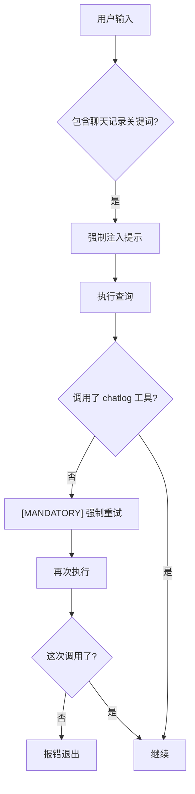
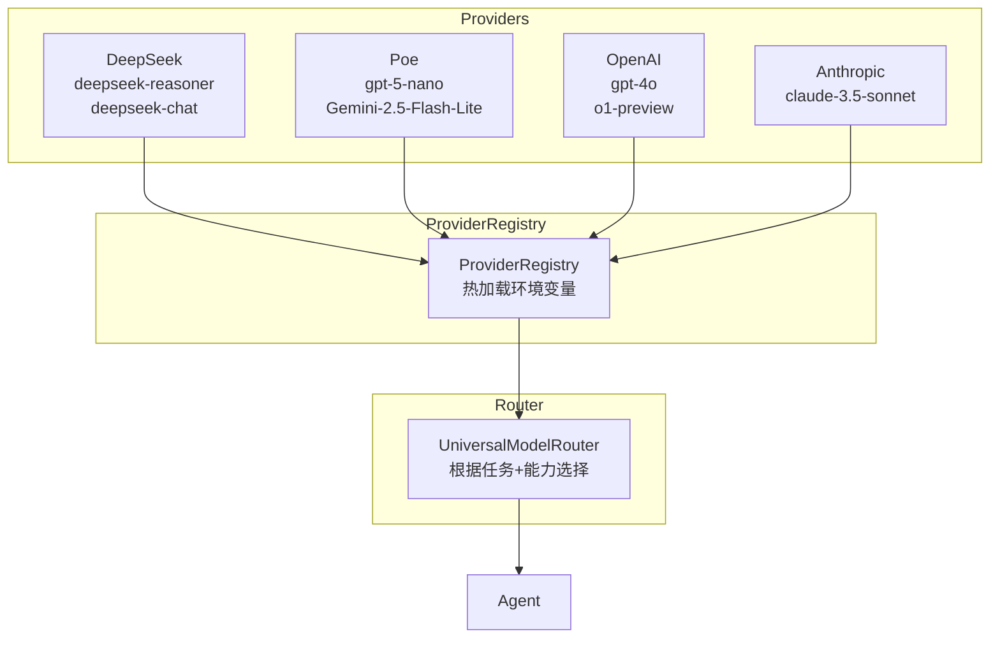

# BENEDICTJUN Agent 架构审计报告

> **报告日期**: 2026-01-11  
> **审计范围**: 整体项目架构、模型路由、Workflow 反模式检测  
> **核心目标**: 识别违背 Agent 本意的 Workflow 模式，设计多 Provider 模型路由

---

## 一、执行摘要

### 1.1 Workflow 反模式检测结果

| 严重程度 | 问题数量 | 说明 |
|----------|----------|------|
| 🔴 严重 | 3 | 直接违背 Agent 自主决策原则 |
| 🟡 中等 | 4 | 限制 Agent 能力但有合理性 |
| 🟢 轻微 | 2 | 可优化但影响较小 |

### 1.2 模型路由设计建议

| 现状 | 建议 |
|------|------|
| 仅支持 DeepSeek | 支持多 Provider（DeepSeek、Poe、OpenAI 等） |
| 固定 API 密钥 | 热加载多套环境变量 |
| 硬编码模型选择 | 动态 Provider + Model 组合路由 |

---

## 二、Workflow 反模式详细分析

### 2.1 🔴 严重问题 #1：强制工具触发器

**文件**: [trigger.py](file:///c:/Log/benedictjun/src/chatlog/trigger.py)

```python
def should_use_chatlog_chain(text: str) -> bool:
    """Decide whether to force the chatlog subagent chain."""
    explicit_phrases = [
        "请查找聊天记录",
        "查询聊天记录",
        "聊天记录",
        # ...
    ]
    return any(phrase in normalized for phrase in explicit_phrases)
```

**问题分析**：

| 问题 | 说明 |
|------|------|
| **硬编码触发** | 用户输入包含特定短语就强制触发 chatlog 链 |
| **绕过 Agent 决策** | Agent 没有机会自己判断是否需要查询 |
| **Workflow 思维** | 预定义"关键词 → 工具"映射，而非让 Agent 推理 |

**Agent 正确做法**：
- 在 system prompt 中告知 Agent 有 chatlog 工具可用
- 让 Agent 自己判断是否需要调用
- 信任 Agent 的推理能力

**建议修复**：

```diff
- if should_use_chatlog_chain(text):
-     text = f"""## 重要提示
- 你需要调用 mcp__chatlog__query_chatlog 工具...
- """

+ # 不再强制注入，让 Agent 自主决策
+ # chatlog 工具已在 MCP servers 中注册，Agent 会在需要时调用
```

---

### 2.2 🔴 严重问题 #2：强制重试机制

**文件**: [tui_agent.py#L1645-1677](file:///c:/Log/benedictjun/tui_agent.py#L1645-1677)

```python
if use_chatlog and REQUIRED_CHATLOG_TOOL not in tool_trace:
    console.print("未检测到调用，将强制重试一次。")
    retry_text = f"""[MANDATORY]
你必须首先调用 {REQUIRED_CHATLOG_TOOL} 工具。
未收到工具结果前不得输出分析或结论。
"""
    await run_query(client, retry_text, abort_on_unexpected_tool=True)
```

**问题分析**：



**这是典型的 Workflow 流程**：
1. 预设固定步骤
2. 检查步骤是否执行
3. 未执行则强制重试
4. 完全无视 Agent 可能有的合理理由

**Agent 为什么可能"不调用"？**
- Agent 可能已从 memory 中获取足够信息
- Agent 可能判断问题不需要历史数据
- Agent 可能认为其他工具更合适

**建议修复**：

```diff
- if use_chatlog and REQUIRED_CHATLOG_TOOL not in tool_trace:
-     retry_text = f"""[MANDATORY]..."""
-     await run_query(client, retry_text, abort_on_unexpected_tool=True)

+ # 移除强制重试，信任 Agent 决策
+ # 如果确实需要引导，可以在 system prompt 中添加：
+ # "当用户询问历史对话相关问题时，优先考虑使用 chatlog 工具"
```

---

### 2.3 🔴 严重问题 #3：工具阻断机制

**文件**: [tui_agent.py#L602-712](file:///c:/Log/benedictjun/tui_agent.py#L602-712)

```python
async def run_query(..., abort_on_unexpected_tool: bool = False):
    # ...
    if abort_stream and abort_on_unexpected_tool:
        # 如果调用了非预期工具，阻断执行
        break
```

**问题分析**：

| 参数 | 说明 |
|------|------|
| `expected_tool_prefix` | 限制只能调用特定前缀的工具 |
| `abort_on_unexpected_tool` | 调用其他工具直接中断 |

**这意味着**：
- 当 `use_chatlog=True` 时，Agent 只能调用 `mcp__chatlog__*` 工具
- 如果 Agent 想先调用 memory 工具获取用户偏好，会被阻断
- 完全剥夺了 Agent 的工具组合能力

**Agent 应有的权利**：
- 自主选择任何可用工具
- 组合使用多个工具
- 根据情况调整策略

**建议修复**：

```diff
- await run_query(
-     client, text,
-     expected_tool_prefix="mcp__chatlog__" if use_chatlog else None,
-     abort_on_unexpected_tool=use_chatlog
- )

+ await run_query(
+     client, text,
+     # 移除工具限制，让 Agent 自由选择
+ )
```

---

### 2.4 🟡 中等问题 #1：工具白名单过滤

**文件**: [tui_agent.py#L1543-1544](file:///c:/Log/benedictjun/tui_agent.py#L1543-1544)

```python
if use_chatlog:
    routed_tools = [t for t in routed_tools if t.startswith("mcp__chatlog__")]
```

**问题分析**：
- 当检测到"chatlog 查询"时，直接过滤掉所有非 chatlog 工具
- Agent 失去了使用 memory、web search 等工具的能力

**这比 abort 稍好**，因为至少没有阻断，但仍然限制了 Agent

---

### 2.5 🟡 中等问题 #2：跳过实体归因

**文件**: [mcp_server.py#L279-281](file:///c:/Log/benedictjun/src/chatlog/mcp_server.py#L279-281)

```python
if "命中窗口" in raw_text:
    cleaned = raw_text  # 直接返回，不调用 entity_attribution
    log("跳过清洗：已包含命中窗口上下文", "CLEAN")
```

**问题分析**：
- 有 CoT 实体归因能力但从未调用
- 导致关于其他人物的对话混入结果
- Agent 收到污染的数据，无法做出准确判断

---

### 2.6 🟡 中等问题 #3：模型能力限制

**文件**: [router.py](file:///c:/Log/benedictjun/src/router.py)

```python
if require_tools or self._needs_tools(prompt_lower):
    return RoutingDecision(
        model=self.MODEL_CHAT,
        task_type=TaskType.TOOL_USE,
        reason="需要工具调用 → V3.2",
        supports_tools=True
    )
```

**问题分析**：
- R1 模型不支持工具调用，但这是技术限制
- 问题在于：一旦检测到可能需要工具，就强制切换到 V3.2
- Agent 没有机会"先用 R1 思考，再决定是否需要工具"

---

### 2.7 🟡 中等问题 #4：提示词注入覆盖用户输入

**文件**: [tui_agent.py#L1508-1518](file:///c:/Log/benedictjun/tui_agent.py#L1508-1518)

```python
text = f"""## 重要提示
你需要调用 mcp__chatlog__query_chatlog 工具...
调用工具时，question 参数必须使用用户原话，不要自行扩展关键词或场景。
如证据不足，请明确说明"无法判断/证据不足"。
仅进行一次工具调用，不要使用子代理链。

## 用户问题
{text}"""
```

**问题分析**：

| 指令 | 问题 |
|------|------|
| "仅进行一次工具调用" | 限制了 Agent 的多步推理 |
| "不要使用子代理链" | 阻止了复杂任务分解 |
| "不要自行扩展关键词" | 限制了 Agent 的语义理解 |

---

### 2.8 🟢 轻微问题 #1：单一 Provider 依赖

**文件**: [router.py](file:///c:/Log/benedictjun/src/router.py)

```python
MODEL_REASONER = "deepseek-reasoner"  # R1
MODEL_CHAT = "deepseek-chat"          # V3.2
```

**问题**：只支持 DeepSeek，无法灵活切换 Provider

---

### 2.9 🟢 轻微问题 #2：硬编码环境变量

**文件**: [.env](file:///c:/Log/benedictjun/.env)

```
ANTHROPIC_BASE_URL=https://api.deepseek.com/anthropic
ANTHROPIC_AUTH_TOKEN=sk-84fbe6c24c32410db0398d5d53b4249e
```

**问题**：无法运行时切换 Provider，需要修改 .env 并重启

---

## 三、Agent vs Workflow 对比表

| 行为 | Workflow 做法 ❌ | Agent 做法 ✅ |
|------|------------------|---------------|
| 工具选择 | 预定义工具序列 | Agent 自主决策 |
| 错误处理 | 强制重试相同操作 | Agent 调整策略 |
| 能力限制 | 过滤可用工具 | 提供全部工具，信任 Agent |
| 提示词 | 命令式（"你必须..."） | 说明式（"你可以..."） |
| 验证 | 检查特定工具是否调用 | 评估最终答案质量 |

---

## 四、多 Provider 模型路由设计

### 4.1 热加载多环境变量架构



### 4.2 建议的 Provider 配置格式

```python
# .env 示例 - 多 Provider 配置
# DeepSeek Provider
PROVIDER_DEEPSEEK_API_KEY=sk-84fbe6c24c32410db0398d5d53b4249e
PROVIDER_DEEPSEEK_BASE_URL=https://api.deepseek.com/anthropic
PROVIDER_DEEPSEEK_MODELS=deepseek-reasoner,deepseek-chat

# Poe Provider
PROVIDER_POE_API_KEY=n0rGLBgnYUBPK6Ca-Naqr-HECpr7BoUb4J4cDp08INY
PROVIDER_POE_BASE_URL=https://api.poe.com
PROVIDER_POE_MODELS=gpt-5-nano,Gemini-2.5-Flash-Lite,Claude-3.5-Sonnet

# OpenAI Provider (备用)
PROVIDER_OPENAI_API_KEY=sk-xxx
PROVIDER_OPENAI_BASE_URL=https://api.openai.com/v1
PROVIDER_OPENAI_MODELS=gpt-4o,gpt-4o-mini

# 默认主模型配置
DEFAULT_MAIN_PROVIDER=deepseek
DEFAULT_MAIN_MODEL=deepseek-chat
DEFAULT_REASONER_MODEL=deepseek-reasoner

# 辅助模型配置（小模型任务）
DEFAULT_HELPER_PROVIDER=poe
DEFAULT_HELPER_MODEL=Gemini-2.5-Flash-Lite
```

### 4.3 ProviderRegistry 实现设计

```python
@dataclass
class ProviderConfig:
    name: str
    api_key: str
    base_url: str
    models: List[str]
    supports_tools: Dict[str, bool]  # model -> bool
    supports_streaming: Dict[str, bool]

class ProviderRegistry:
    """热加载多 Provider 注册表"""
    
    def __init__(self):
        self._providers: Dict[str, ProviderConfig] = {}
        self._load_from_env()
    
    def _load_from_env(self):
        """从环境变量加载 Provider 配置"""
        for key, value in os.environ.items():
            if key.startswith("PROVIDER_") and key.endswith("_API_KEY"):
                provider_name = key.split("_")[1].lower()
                self._register_provider(provider_name)
    
    def reload(self):
        """热重载配置（不重启应用）"""
        from dotenv import load_dotenv
        load_dotenv(override=True)
        self._providers.clear()
        self._load_from_env()
    
    def get_client(self, provider: str, model: str) -> Any:
        """获取特定 Provider + Model 的客户端"""
        config = self._providers.get(provider)
        if not config:
            raise ValueError(f"Provider {provider} not configured")
        # 返回适配器客户端
        return self._create_client(config, model)
```

### 4.4 UniversalModelRouter 设计

```python
@dataclass
class UniversalRoutingDecision:
    provider: str           # deepseek, poe, openai...
    model: str              # 具体模型名
    task_type: TaskType
    reason: str
    supports_tools: bool
    supports_streaming: bool
    confidence: float

class UniversalModelRouter:
    """多 Provider 通用路由器"""
    
    def __init__(self, registry: ProviderRegistry):
        self.registry = registry
        self._capabilities = self._build_capability_map()
    
    def route(self, prompt: str, require_tools: bool = False) -> UniversalRoutingDecision:
        """路由到最佳 Provider + Model 组合"""
        task_type = self._classify_task(prompt)
        
        # 根据任务类型选择最佳模型
        if task_type in (TaskType.MATH, TaskType.CODE, TaskType.REASONING):
            # 推理任务优先使用 deepseek-reasoner
            if not require_tools:
                return UniversalRoutingDecision(
                    provider="deepseek",
                    model="deepseek-reasoner",
                    task_type=task_type,
                    reason="复杂推理 → DeepSeek R1",
                    supports_tools=False,
                    supports_streaming=True,
                    confidence=0.9
                )
        
        if require_tools:
            # 需要工具时选择支持工具的模型
            for provider, config in self.registry.providers.items():
                for model in config.models:
                    if config.supports_tools.get(model, False):
                        return UniversalRoutingDecision(
                            provider=provider,
                            model=model,
                            task_type=TaskType.TOOL_USE,
                            reason=f"工具调用 → {provider}/{model}",
                            supports_tools=True,
                            supports_streaming=True,
                            confidence=0.85
                        )
        
        # 默认使用主模型
        return self._default_decision()
```

### 4.5 TUI 命令扩展

```python
# 新增 /provider 命令
"/provider": "Manage model providers",

# 使用示例
/provider list              # 列出所有可用 Provider
/provider switch poe        # 切换到 Poe Provider
/provider reload            # 热重载环境变量
/provider test gpt-5-nano   # 测试特定模型连接
```

---

## 五、改进路线图

### 5.1 短期（1-2 天）

| 优先级 | 任务 | 文件 |
|--------|------|------|
| P0 | 移除强制重试机制 | `tui_agent.py` |
| P0 | 移除工具阻断 | `tui_agent.py` |
| P0 | 移除工具过滤 | `tui_agent.py` |
| P1 | 添加 entity_attribution 调用 | `mcp_server.py` |

### 5.2 中期（3-5 天）

| 优先级 | 任务 | 说明 |
|--------|------|------|
| P1 | 实现 ProviderRegistry | 多 Provider 支持 |
| P1 | 实现 UniversalModelRouter | 通用路由 |
| P2 | 添加 /provider 命令 | TUI 集成 |
| P2 | 热加载环境变量 | 无需重启 |

### 5.3 长期（1-2 周）

| 任务 | 说明 |
|------|------|
| Provider 健康检查 | 自动故障转移 |
| 成本追踪 | 按 Provider 统计费用 |
| 模型能力自动发现 | 通过测试确定支持的特性 |

---

## 六、核心结论

### 6.1 Workflow 反模式总结

| 代码位置 | 问题 | 影响 |
|----------|------|------|
| `trigger.py` | 关键词触发强制链 | 绕过 Agent 决策 |
| `tui_agent.py:1645-1677` | 强制重试 | 不信任 Agent |
| `tui_agent.py:667-712` | 工具阻断 | 剥夺工具选择权 |
| `tui_agent.py:1543-1544` | 工具过滤 | 限制可用工具 |
| `mcp_server.py:279-281` | 跳过 entity_attribution | 数据污染 |
| 提示词注入 | "不要使用子代理链" | 限制多步推理 |

### 6.2 Agent 设计原则

> [!IMPORTANT]
> **Agent 的核心是自主决策**：
> 1. **信任 Agent** - 不要强制特定工具
> 2. **完整能力** - 提供所有工具，让 Agent 选择
> 3. **说明而非命令** - "你可以使用..." 而非 "你必须使用..."
> 4. **评估结果** - 关注答案质量，而非检查步骤

### 6.3 多 Provider 价值

| 能力 | 说明 |
|------|------|
| **冗余备份** | 一个 Provider 不可用时自动切换 |
| **成本优化** | 简单任务用便宜模型，复杂任务用强模型 |
| **能力互补** | 不同模型擅长不同任务 |
| **灵活部署** | 按需选择 Provider |
