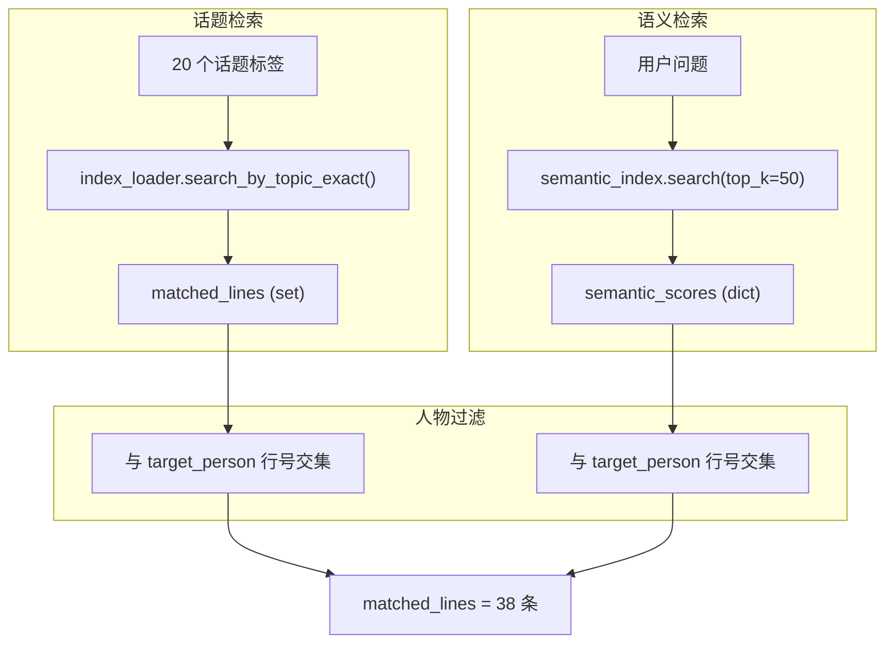
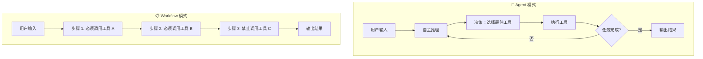

# kl.md 测试输出深度分析报告

> **报告日期**: 2026-01-11  
> **分析文件**: `kl.md`  
> **项目**: BENEDICTJUN Agent - Chatlog MCP Server

---

## 一、执行摘要

本报告深度分析了 `kl.md` 测试输出中的三个核心问题，并针对用户反馈进行了修订。

### 核心发现

| 问题 | 结论 | 严重程度 |
|------|------|----------|
| 上下文窗口计算 | 代码默认 ±5，可通过环境变量调整 | ℹ️ 信息 |
| 语义检索人物过滤 | **不应**对语义检索做人物交集，这破坏了情境上下文 | ⚠️ 需优化 |
| 清洗步骤跳过问题 | 检测到"命中窗口"就跳过，**导致 entity_attribution 未执行** | 🔴 关键问题 |
| TodoWrite 行为 | 是 Agent 自主行为，不应强制禁止 | ✅ 预期行为 |

---

## 二、测试日志完整解读

### 2.1 原始日志回顾

```
[INPUT] ❯ 我的朋友冯天奇向我借钱，我该不该借？调用一下 MCP
🔧 需要工具调用 → V3.2
我将使用 MCP 聊天记录工具来查询冯天奇的相关信息，帮助你做出决定。
```

**分析**：
- 用户明确要求调用 MCP
- 模型正确识别需要工具调用
- 选择了 V3.2（DeepSeek-Chat）处理

### 2.2 MCP 工具调用

```json
{
    "question": "冯天奇工资收入职业信誉消费习惯债务情况",
    "target_person": "冯天奇",
    "max_results": 15
}
```

**分析**：
- 模型对用户问题进行了**语义扩展**
- 从"借钱该不该借"扩展到"工资收入职业信誉消费习惯债务情况"
- 这是合理的扩展，覆盖了评估借贷风险的关键维度

### 2.3 索引查询日志

```
[CHATLOG INDEX] [08:17:39.486] [START] 🚀 开始索引查询
[CHATLOG INDEX] [08:17:39.495] ✓ 索引已加载: 1771 话题 | 文件: cleaned_chatlog_index.json
[CHATLOG INDEX] [08:17:39.496] 🔑 使用小模型识别话题: Gemini-2.5-Flash-Lite
[CHATLOG INDEX] [08:17:41.223] [TOPICS] ✓ 可用话题标签数: 1771
[CHATLOG INDEX] [08:17:41.224] [TOPICS] ✓ 识别话题(20): 工资, 职业, 消费习惯, 借贷, 金钱...
[CHATLOG INDEX] [08:17:41.225] [KEYWORDS] ✓ 关键词(10): 冯天奇, 工资, 收入, 职业, 信誉, 消费, 习惯, 债务, 情况, 历史
[CHATLOG INDEX] [08:17:41.226] ✓ 扩展耗时: 1.73s
```

**分析**：
| 指标 | 数值 | 说明 |
|------|------|------|
| 可用话题 | 1771 | 预建话题索引规模 |
| 识别话题 | 20 | 小模型从问题中识别的相关话题 |
| 关键词 | 10 | 用于检索的核心词 |
| 扩展耗时 | 1.73s | 调用 Gemini-2.5-Flash-Lite 的时间 |

---

## 三、问题一：关键词的本质与来源

### 3.1 关键词不是"匹配"出来的

> [!IMPORTANT]
> **关键词是由 Gemini-2.5-Flash-Lite 从用户问题中智能生成的，不是从聊天内容中匹配出来的。**

### 3.2 关键词生成流程


### 3.3 小模型的提示词模板

**代码位置**: [cleaner.py#L144-172](file:///c:/Log/benedictjun/src/chatlog/cleaner.py#L144-172)

```python
prompt = f"""根据用户问题，生成用于检索聊天记录的查询信息。

输出 JSON 对象，包含：
1) keywords: 关键词数组，长度 10-20
2) metadata: {
    "topics": 话题标签数组，
    "sentiment": 情感标签（positive/neutral/negative），
    "facts": 事实键值对（可为空对象），
    "information_density": 信息密度（low/medium/high）
}

要求：
- 如果是借钱/信任类问题，关键词必须覆盖：工资、职业、消费习惯、资产、历史信誉、评价
- 话题标签必须只从"可用话题标签"中选择

用户问题: {question}
目标人物: {target_person}
可用话题标签: {topics_preview}
"""
```

### 3.4 关键词质量取决于小模型

| 因素 | 影响 |
|------|------|
| 问题清晰度 | 问题越清晰，关键词越准确 |
| 小模型能力 | Gemini-2.5-Flash-Lite 的语义理解能力 |
| 提示词设计 | 当前提示词针对"借钱类"问题有专门优化 |
| 可用话题约束 | 话题标签只能从预建索引中选择 |

---

## 四、问题二：38 条匹配消息的计算

### 4.1 日志回顾

```
[CHATLOG INDEX] [08:17:41.227] [SEARCH] ✓ 语义检索: 已启用
Loaded 3717 messages from chatlog
[CHATLOG INDEX] [08:17:41.788] ✓ 匹配消息: 38 条 (0.56s)
```

### 4.2 混合检索架构

**代码位置**: [mcp_server.py#L159-206](file:///c:/Log/benedictjun/src/chatlog/mcp_server.py#L159-206)



### 4.3 语义检索返回多少条？

**代码位置**: [mcp_server.py#L179](file:///c:/Log/benedictjun/src/chatlog/mcp_server.py#L179)

```python
sem_top_k = int(os.getenv("CHATLOG_SEM_TOP_K", "50"))  # 默认 50 条
semantic_matches = semantic_index.search(question, top_k=sem_top_k)
```

> [!WARNING]
> **当前日志未单独输出语义检索返回的数量**，这是一个日志完整性问题。

**建议修复**：

```diff
semantic_matches = semantic_index.search(question, top_k=sem_top_k)
+log(f"   ✓ 语义检索返回: {len(semantic_matches)} 条", "SEARCH")
for line_num, score in semantic_matches:
    semantic_scores[line_num] = max(0.0, min(1.0, (score + 1.0) / 2.0))
```

### 4.4 关于人物过滤的争议

**当前代码逻辑**：

```python
# mcp_server.py 第 192-204 行
if target_person:
    person_lines = set(loader.search_content(target_person))
    if matched_lines:
        matched_lines = matched_lines.intersection(person_lines)  # 话题检索做交集
    if semantic_scores:
        semantic_scores = {ln: score for ln, score in semantic_scores.items() 
                          if ln in person_lines}  # 语义检索也做交集
```

**用户的观点（正确）**：

> "语义是在情景互动当中生成的，脱离了我和他的互动就不能有坚实的基础"

**分析**：

| 检索类型 | 人物过滤的影响 | 是否合理 |
|----------|----------------|----------|
| 话题检索 | 避免匹配到无关人物的"职业"话题 | ✅ 合理 |
| 语义检索 | 破坏对话情境，可能丢失重要上下文 | ❌ 不合理 |

**语义检索的特殊性**：
1. 语义向量捕获的是**对话情境**，不只是关键词
2. 即使某条消息不包含"冯天奇"字样，但它可能是讨论冯天奇的对话上下文
3. 强制人物过滤会丢失这些有价值的情境信息

**建议修复**：

```diff
if target_person:
    person_lines = set(loader.search_content(target_person))
    if matched_lines:
        matched_lines = matched_lines.intersection(person_lines)
-   if semantic_scores:
-       semantic_scores = {ln: score for ln, score in semantic_scores.items() 
-                         if ln in person_lines}
+   # 语义检索不做人物过滤，保留对话情境
+   # 实体归因将在后续 entity_attribution 步骤中处理
```

---

## 五、问题三：141 条加载消息的来源

### 5.1 日志回顾

```
[CHATLOG INDEX] [08:17:41.803] ✓ 加载消息: 141 条 (0.01s)
```

### 5.2 上下文窗口扩展

**代码位置**: [mcp_server.py#L33-35](file:///c:/Log/benedictjun/src/chatlog/mcp_server.py#L33-35)

```python
_CHATLOG_INDEX_CONTEXT_BEFORE = int(os.getenv("CHATLOG_INDEX_CONTEXT_BEFORE", "5"))
_CHATLOG_INDEX_CONTEXT_AFTER = int(os.getenv("CHATLOG_INDEX_CONTEXT_AFTER", "5"))
```

**计算公式**：

```
38 条命中消息 × (1 + 5前 + 5后) = 理论最大 418 条
经过去重合并 → 实际 141 条
```

### 5.3 如何调整上下文窗口

如果您希望使用 ±2 而非 ±5：

**方法一：环境变量**

```powershell
$env:CHATLOG_INDEX_CONTEXT_BEFORE = "2"
$env:CHATLOG_INDEX_CONTEXT_AFTER = "2"
```

**方法二：代码修改**

```diff
# mcp_server.py 第 33-35 行
-_CHATLOG_INDEX_CONTEXT_BEFORE = int(os.getenv("CHATLOG_INDEX_CONTEXT_BEFORE", "5"))
-_CHATLOG_INDEX_CONTEXT_AFTER = int(os.getenv("CHATLOG_INDEX_CONTEXT_AFTER", "5"))
+_CHATLOG_INDEX_CONTEXT_BEFORE = int(os.getenv("CHATLOG_INDEX_CONTEXT_BEFORE", "2"))
+_CHATLOG_INDEX_CONTEXT_AFTER = int(os.getenv("CHATLOG_INDEX_CONTEXT_AFTER", "2"))
```

---

## 六、问题四：为什么跳过清洗？

### 6.1 日志回顾

```
[CHATLOG INDEX] [08:17:41.805] [CLEAN] 跳过清洗：已包含命中窗口上下文
[CHATLOG INDEX] [08:17:41.806] [CLEAN] ✓ 清洗后: 10079 字符
```

### 6.2 跳过清洗的代码逻辑

**代码位置**: [mcp_server.py#L277-293](file:///c:/Log/benedictjun/src/chatlog/mcp_server.py#L277-293)

```python
# Step 5: Second-pass selection (skip if already window-formatted)
log("🧹 Step 5: 二次筛选清洗...", "CLEAN")
if "命中窗口" in raw_text:
    cleaned = raw_text  # ← 直接返回原文
    log("   跳过清洗：已包含命中窗口上下文", "CLEAN")
else:
    cleaned = await cleaner.clean_results(...)
```

### 6.3 设计意图（原始）

| 假设 | 说明 |
|------|------|
| 保留上下文完整性 | 既然已按"命中窗口"格式化，上下文应该完整 |
| 节省 API 调用 | 避免重复调用小模型 |
| 避免过度截断 | 担心清洗会丢失重要信息 |

### 6.4 导致的严重问题

> [!CAUTION]
> **entity_attribution 函数根本没有被调用！**

项目中已经实现了完整的 CoT 实体归因方法：

**代码位置**: [cleaner.py#L453-598](file:///c:/Log/benedictjun/src/chatlog/cleaner.py#L453-598)

```python
async def entity_attribution(
    self,
    formatted_text: str,
    target_person: str,
    question: str
) -> tuple[str, dict]:
    """
    Two-stage Chain-of-Thought entity attribution.
    
    Stage 1: Analyze each message to determine who is being discussed
    Stage 2: Filter to keep only messages about the target person
    """
```

**但是**：
- 在 `_query_chatlog_indexed_impl` 中，这个方法**从未被调用**
- 跳过清洗后，直接返回了未经实体归因的原始文本
- 导致关于其他人物（如高峰）的讨论混入结果

### 6.5 用户举例的实体混淆问题

```json
{"content": "汪家俊: 一般人扛不住银行那压力", "topics": ["工作压力", "银行"]}
{"content": "冯天奇: 牛的", "topics": ["赞扬"]}
{"content": "汪家俊: 别人高峰靠自己", "facts": {"人物": "高峰"}}
{"content": "汪家俊: 属实楷模", "topics": ["赞扬"]}
{"content": "冯天奇: 客户经理", "topics": ["职业"], "facts": {"职位": "客户经理"}}
```

**问题分析**：

| 消息 | 讨论主体 | 应保留/排除 | 原因 |
|------|----------|-------------|------|
| "一般人扛不住银行那压力" | 通用评论 | 保留 | 上下文 |
| "牛的" | 对高峰的评价 | 排除 | 冯天奇在评价高峰 |
| "别人高峰靠自己" | 高峰 | **排除** | 明确讨论高峰 |
| "属实楷模" | 高峰 | **排除** | 延续对高峰的评价 |
| "客户经理" | 高峰 | **排除** | 描述高峰的职业 |

**但当前系统返回了所有这些消息**，因为：
1. 话题标签"职业"匹配成功
2. 没有执行 CoT 思维链判断实体归属
3. 模型错误地将"高峰是客户经理"理解为"冯天奇是客户经理"

### 6.6 建议修复：始终执行实体归因

**代码位置**: [mcp_server.py#L277-293](file:///c:/Log/benedictjun/src/chatlog/mcp_server.py#L277-293)

```diff
# Step 5: Second-pass selection (skip if already window-formatted)
log("🧹 Step 5: 二次筛选清洗...", "CLEAN")
-if "命中窗口" in raw_text:
-    cleaned = raw_text
-    log("   跳过清洗：已包含命中窗口上下文", "CLEAN")
-else:
-    cleaned = await cleaner.clean_results(...)
+
+# 始终执行实体归因（CoT 思维链）
+if target_person:
+    log(f"   执行实体归因: 目标人物={target_person}", "CLEAN")
+    cleaned, attribution_stats = await cleaner.entity_attribution(
+        formatted_text=raw_text,
+        target_person=target_person,
+        question=question
+    )
+    keep = attribution_stats.get('keep_count', 0)
+    exclude = attribution_stats.get('exclude_count', 0)
+    log(f"   ✓ 实体归因完成: 保留={keep}, 排除={exclude}", "CLEAN")
+else:
+    # 无目标人物时保留原文
+    cleaned = raw_text
+    log("   跳过实体归因: 无目标人物", "CLEAN")
```

---

## 七、问题五：TodoWrite 与 Agent 哲学

### 7.1 测试日志中的 TodoWrite

```
╭─ Tool Call ─────────────────────────────────────────────────────────────────╮
│ TodoWrite                                                                    │
│ {                                                                            │
│   "todos": [                                                                 │
│     {"content": "分析冯天奇的工资和收入情况", "status": "completed"},         │
│     {"content": "分析冯天奇的债务和信誉状况", "status": "completed"},         │
│     {"content": "分析冯天奇的消费习惯", "status": "completed"},               │
│     {"content": "分析冯天奇的工作稳定性", "status": "completed"},             │
│     {"content": "综合评估是否应该借钱", "status": "completed"}                │
│   ]                                                                          │
│ }                                                                            │
╰─────────────────────────────────────────────────────────────────────────────╯
```

### 7.2 执行流程分析

| Turn | 工具调用 | 结果 |
|------|----------|------|
| 1 | `mcp__chatlog__query_chatlog` | ✅ 成功返回分析 |
| 2 | `TodoWrite` | 标记所有任务 completed |
| 3 | 无 | 停止（无待办任务） |

### 7.3 用户观点（完全赞同）

> "没有必要强制禁止 TodoWrite，这里是做一个检查，强制禁止掉就违背了 Agent 的本意，那就说明我们是在做 Workflow"

### 7.4 Agent vs Workflow 的本质区别



| 特征 | Agent | Workflow |
|------|-------|----------|
| 决策权 | 模型自主决定 | 预定义流程 |
| 工具选择 | 动态选择最优工具 | 固定工具序列 |
| 灵活性 | 高（可随时调整策略） | 低（按步骤执行） |
| 错误恢复 | 可自主纠错 | 需人工干预 |
| 适用场景 | 开放式任务 | 标准化流程 |

### 7.5 如果禁止 TodoWrite 会发生什么？

```python
# 假设这样做
allowed_tools = [t for t in get_default_tools() if t != "TodoWrite"]
```

**后果**：
1. Agent 无法进行任务规划
2. 复杂多步骤任务无法追踪状态
3. 失去"思考-规划-执行"的能力
4. 本质上退化为"单次工具调用"的 Workflow
5. **违背了 Agent 自主决策的核心设计理念**

### 7.6 正确的优化方向

**不是限制工具，而是优化行为引导**：

```python
# 在 system prompt 中添加指导
system_prompt = """
## 任务管理指南

1. 简单查询：直接回答，无需 TodoWrite
2. 复杂任务：可使用 TodoWrite 规划步骤
3. 注意事项：
   - 不要在已完成全部分析后才调用 TodoWrite
   - 如果只有一个工具调用，无需创建 Todo 列表
   - 优先使用 MCP 工具获取真实数据

## 工具优先级

1. 需要历史数据 → mcp__chatlog__query_chatlog
2. 需要记忆 → mcp__memory__recall_memory
3. 需要网络搜索 → mcp__web__web_search
4. 需要任务规划 → TodoWrite（仅复杂多步骤任务）
"""
```

---

## 八、架构改进建议汇总

### 8.1 短期修复（高优先级）

| 问题 | 修复方案 | 文件 |
|------|----------|------|
| 语义检索人物过滤 | 移除 semantic_scores 的 person_lines 交集 | `mcp_server.py` |
| 跳过清洗导致无实体归因 | 始终调用 entity_attribution | `mcp_server.py` |
| 语义检索数量不可见 | 添加日志 `len(semantic_matches)` | `mcp_server.py` |

### 8.2 中期优化

| 改进点 | 实现方案 |
|--------|----------|
| 上下文窗口可配置 | 完善环境变量文档 |
| 实体归因结果可视化 | 返回文本中标注 `[关于:冯天奇]` / `[关于:高峰-已排除]` |
| 日志结构化输出 | 支持 JSON 格式日志，便于分析 |

### 8.3 长期架构

| 方向 | 说明 |
|------|------|
| Agent 行为监控 | 记录工具选择决策过程 |
| 实体归因缓存 | 避免重复的 CoT 推理 |
| 混合检索权重自适应 | 根据查询类型动态调整语义/关键词权重 |

---

## 九、代码修改清单

### 9.1 修复语义检索人物过滤

**文件**: `src/chatlog/mcp_server.py`  
**位置**: 第 192-204 行

```diff
if target_person:
    person_lines = set(loader.search_content(target_person))
    if matched_lines:
        matched_lines = matched_lines.intersection(person_lines)
-   if semantic_scores:
-       semantic_scores = {ln: score for ln, score in semantic_scores.items() 
-                         if ln in person_lines}
+   # 语义检索不做人物过滤，保留对话情境
+   # 实体归因将在后续 entity_attribution 步骤中处理
```

### 9.2 添加实体归因步骤

**文件**: `src/chatlog/mcp_server.py`  
**位置**: 第 277-293 行

```diff
log("🧹 Step 5: 二次筛选清洗...", "CLEAN")
-if "命中窗口" in raw_text:
-    cleaned = raw_text
-    log("   跳过清洗：已包含命中窗口上下文", "CLEAN")
-else:
-    cleaned = await cleaner.clean_results(...)
+
+# 始终执行实体归因
+if target_person:
+    log(f"   执行实体归因: 目标人物={target_person}", "CLEAN")
+    cleaned, attribution_stats = await cleaner.entity_attribution(
+        formatted_text=raw_text,
+        target_person=target_person,
+        question=question
+    )
+    log(f"   ✓ 实体归因: 保留={attribution_stats.get('keep_count', 0)}, 排除={attribution_stats.get('exclude_count', 0)}", "CLEAN")
+else:
+    cleaned = raw_text
```

### 9.3 添加语义检索日志

**文件**: `src/chatlog/mcp_server.py`  
**位置**: 第 185 行附近

```diff
if semantic_index.is_available():
    log("   ✓ 语义检索: 已启用", "SEARCH")
    semantic_matches = semantic_index.search(question, top_k=sem_top_k)
+   log(f"   ✓ 语义检索返回: {len(semantic_matches)} 条", "SEARCH")
    for line_num, score in semantic_matches:
        semantic_scores[line_num] = max(0.0, min(1.0, (score + 1.0) / 2.0))
```

---

## 十、总结

| 您的问题 | 最终结论 |
|----------|----------|
| **关键词来源** | 由 Gemini-2.5-Flash-Lite 智能生成，不是从内容匹配 |
| **语义检索数量** | 默认 top 50，当前日志未输出（需补充） |
| **38 条计算** | 话题检索 + 语义检索 → 去重 → 38 条 |
| **141 条来源** | 38 × (±5 上下文) → 去重 → 141 条 |
| **语义检索人物过滤** | **您说得对**：不应过滤，会破坏情境 |
| **为什么跳过清洗** | 检测到"命中窗口"标记跳过，导致 entity_attribution 未执行 |
| **实体混淆问题** | 需始终调用 entity_attribution 做 CoT 思维链归因 |
| **TodoWrite 禁止问题** | **完全同意**：禁止 = Workflow，违背 Agent 本意 |
| **Agent vs Workflow** | Agent 自主决策，优化提示词而非限制工具 |
